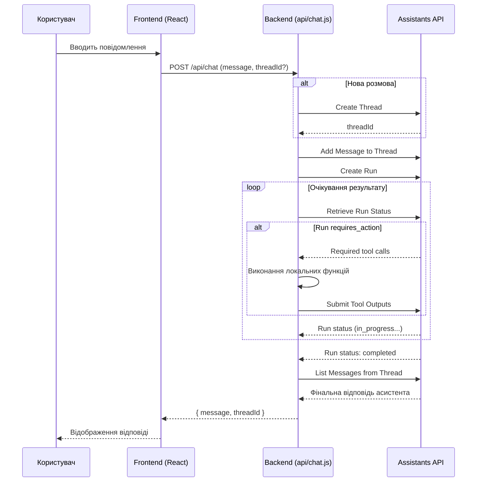

# Документація AI-агента VALORANT HUB (v2 - Assistants API)

Цей документ описує архітектуру, функціонал та налаштування AI-агента, інтегрованого в VALORANT HUB, після переходу на **OpenAI Assistants API**.

## 1. Загальний огляд

AI-агент — це просунутий чат-бот, побудований на базі **OpenAI Assistants API** з моделлю **GPT-4o-mini**. Він здатний не тільки вести діалог, але й самостійно використовувати інструменти для виконання завдань.

### Ключові переваги нової архітектури:
- **Керований стан**: OpenAI керує історією повідомлень, що спрощує код і дозволяє створювати довготривалі розмови.
- **Автоматизовані інструменти**: Агент самостійно обробляє ланцюжки викликів інструментів, що робить логіку на бекенді значно простішою.
- **Масштабованість**: Можливість додавати нові інструменти, включаючи вбудований пошук по файлах (Retrieval) та інтерпретатор коду.

## 2. Архітектура

Система використовує **Assistants API**, що змінює потік даних. Більша частина логіки керування розмовою тепер знаходиться на стороні OpenAI.

1.  **Frontend**: Відправляє повідомлення користувача та `threadId` (ID розмови) на бекенд.
2.  **Backend (`api/chat.js`)**: Отримує запит, додає повідомлення до відповідної розмови (`Thread`), запускає виконання (`Run`) асистента і чекає на результат.
3.  **OpenAI Assistants API**: Виконує основну роботу: обробляє запит, викликає інструменти, зберігає контекст та генерує фінальну відповідь.

### Схема роботи:

## 3. Налаштування

Для роботи асистента необхідно налаштувати наступні змінні середовища на Vercel:

-   `OPENAI_API_KEY`: Ваш секретний ключ для доступу до OpenAI API.
-   `OPENAI_ASSISTANT_ID`: ID вашого асистента, створеного на платформі OpenAI (напр., `asst_...`).

## 4. Інструменти (Functions)

Набір інструментів залишається тим самим, але тепер вони зареєстровані безпосередньо в налаштуваннях асистента на платформі OpenAI. Більше не потрібно передавати їх визначення з кожним запитом.

| Інструмент             | Опис                                                                    |
| ---------------------- | ----------------------------------------------------------------------- |
| `getPlayerStats`       | Статистика гравця (ранг, K/D, ACS).                                     |
| `getPlayerMatches`     | Історія останніх матчів.                                                 |
| `hybridSearch`         | Пошук агентів та гравців.                                               |
| `webSearch`            | Загальний пошук в інтернеті.                                            |
| `searchValorantNews`   | Пошук новин про Valorant.                                               |
| `getPatchNotes`        | Інформація про останні патчі.                                           |
| `searchTournaments`    | Дані про турніри.                                                       |
| `getAgentInfo`         | Актуальна інформація про агентів.                                        |

## 5. Зміни для Frontend

Для коректної роботи з новим бекендом, клієнтська частина має бути оновлена:

1.  **Зберігати `threadId`**: Після першої відповіді від сервера, клієнт повинен зберегти `threadId` (наприклад, у `useState` або `localStorage`).
2.  **Надсилати `threadId`**: У всіх наступних запитах клієнт повинен надсилати цей `threadId` разом з новим повідомленням.
3.  **Формат запиту**: `{ "message": "Привіт!", "threadId": "thread_abc123" }`.
4.  **Формат відповіді**: `{ "message": "Вітаю! Чим можу допомогти?", "threadId": "thread_abc123" }`.

Цей підхід забезпечує безперервність розмови та зберігає контекст між повідомленнями.
